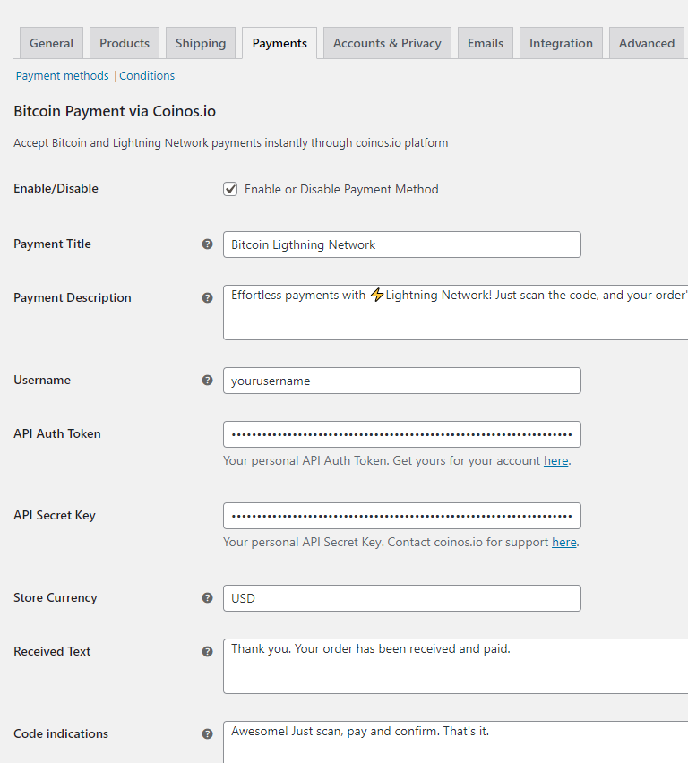

# coinos-woo

**BTC Lightning Payment via Coinos.io**

The provided code constitutes a WooCommerce payment gateway plugin, enabling the seamless processing of Bitcoin and Lightning Network payments via the coinos.io wallet platform.

#### Prior to installing the plugin, please be aware that you'll require a coinos.io wallet account to use it. Get your coinos.io wallet by visiting the official coinos.io website.

- Coinos website: <a href="https://coinos.io" target="_new">https://coinos.io/</a>
- Coinos documentation: <a href="https://coinos.io/docs" target="_new">https://coinos.io/docs</a>
- Coinos support: <a href="https://t.me/coinoswallet" target="_new">https://t.me/coinoswallet</a>

### Disclaimer:

Please note that this plugin and its code do not have official support from Coinos.io. This plugin was designed to facilitate the integration of Coinos.io wallet services into e-commerce websites (WordPress and WooCommerce).

We welcome collaboration to enhance its features.

## Screenshots

<!-- PROJECT EXAMPLE -->
 

    

    

(<a href="#readme-top">back to top</a>)

## Installation

1. Upload the plugin folder to the ‘/wp-content/plugins/’ directory.
2. Activate the plugin through the ‘Plugins’ menu in WordPress.
3. That’s it! you can now configure the plugin by going to WooCommerce > Setttings > Payment tab.

(<a href="#readme-top">back to top</a>)

## Components and functionalities of this plugin:

### Initialization and Configuration:

- The plugin is initialized by hooking the **coinos_payment_init** function to the **plugins_loaded** action with a priority of **11**.

- The plugin creates a class **WC_Coinos_Pay_Gateway** that extends the **WooCommerce WC_Payment_Gateway** class.

- The plugin defines various settings and options using the **init_form_fields** method, which configures the appearance and behavior of the payment gateway in WooCommerce settings.

### Payment Gateway Configuration:

- The constructor of the **WC_Coinos_Pay_Gateway** class sets up various properties such as the gateway's ID, icon, method title, method description, and more.

- The constructor also sets up various hooks and actions that define how the payment gateway behaves within the WooCommerce checkout process.

### Order Processing:

- The **process_payment method** is responsible for processing the payment when a customer places an order.

- It calculates the amount in satoshis, generates an invoice using the coinos.io API, and handles the order status, notes, emails, and redirects accordingly.

### Order Page Display and QR Code Generation:

- The **generate_qr_code** function generates a QR code image for the coinos.io payment using an external QR code generation service.

- The **thankyou_page_qrcode** function is used to display the QR code and payment instructions on the order received (thank you) page after the payment process.

### Webhook Handling:

- The **payment_callback** function processes the webhook callback from coinos.io upon successful payment. It verifies the payment status, updates the order status, and sends notifications to customers and administrators.

### Redirection Handling:

- The **process_redirect** function handles the initial redirection when a payment is initiated through the coinos.io platform. It updates the order status and redirects the customer to a URL for further payment processing.

### Webhook Notifications:

The **coinos_success** and **coinos_failure** functions handle webhook notifications for successful and failed payment events from coinos.io, respectively. They update the order status based on the received data.

### Other Utility Functions:

The plugin includes various utility functions for calculating satoshis, generating invoices, showing partial LN hash on order pages, and more.

### Admin Settings:

The plugin adds settings fields to the WooCommerce payment gateway settings page to allow administrators to configure various options related to the coinos.io payment gateway.

### Email Notifications:

The plugin triggers WooCommerce email notifications to inform customers and administrators about order statuses, payment events, and completed orders.

(<a href="#readme-top">back to top</a>)

## Summary

This plugin integrates the coinos.io payment gateway into WooCommerce, allowing customers to pay using Bitcoin and Lightning Network. It handles payment processing, generates QR codes, updates order statuses, and sends email notifications to keep customers and administrators informed about the payment process and order fulfillment.

(<a href="#readme-top">back to top</a>)

<!-- DISCLAIMER -->

## Disclaimer

Please note that this plugin and its code do not have official support from Coinos.io. This plugin was designed to facilitate the integration of Coinos services into e-commerce websites (WordPress and WooCommerce).

(<a href="#readme-top">back to top</a>)

<!-- LICENSE -->

## License

Distributed under the GNU GPL-2.0 License. See `LICENSE.txt` for more information.

(<a href="#readme-top">back to top</a>)

